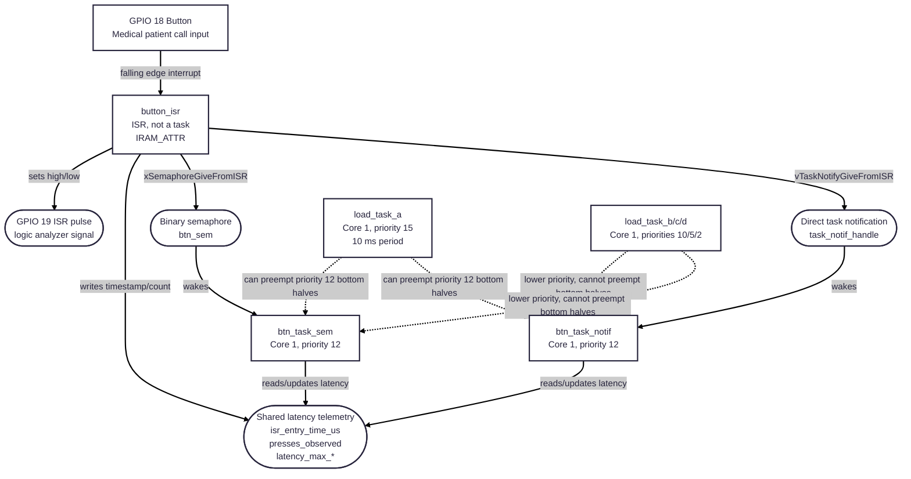

# Medical Alert - Real-Time Systems Final Capstone

FreeRTOS medical-alert simulation comparing semaphore and direct-notification interrupt latency under idle, loaded, and fault-injected conditions.

## Demo
- Video: <YouTube / Wokwi link>
- Live Wokwi: HERMANS-FINAL-RTS26Summer

## Architecture
<diagram + 2–3 sentences on the data/control flow>

## Tasks & timing (WCET evidence)
| Task | Period T | WCET C | U=C/T | Priority | Deadline |
|------|---------:|-------:|------:|---------:|---------:|
<rows from the calculator>
Total utilization U = <value>  (RM bound / EDF feasible: <note>)

## Hazard analysis & standard mapping
<hazard, effect, mitigation; mapped to the standard clause>

## Graceful degradation
<what fails, how it is detected, what the system does instead>

## Build & run
<toolchain, board, how to reproduce>

## Tailored for
<target role> — <why these choices fit that role>
